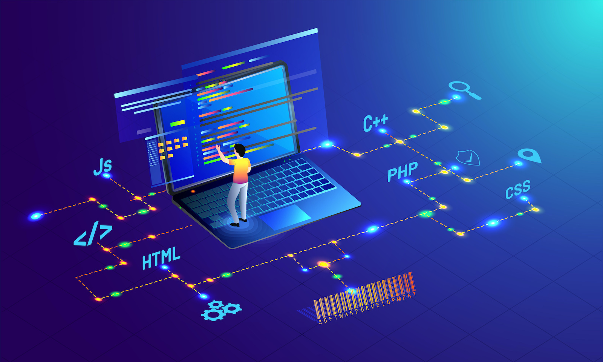

# From Commits to Concepts: A Journey Through Software Engineering

Over the course of this software engineering class, I’ve gained valuable skills not only in web application development, but more importantly, in the foundational principles that apply to software development of all kinds. Concepts like **Agile Project Management**, **Configuration Management**, and **Design Patterns** are not limited to any one technology stack. Instead, they form the backbone of how scalable, maintainable, and collaborative software is built, regardless of the application domain.

In this reflection, I’ll explore how these three concepts go beyond web development and how I could apply them to broader software and technical projects in the future.

---

## Agile Project Management and Issue Driven Project Management

**Agile Project Management (Agile PM)** is a methodology for managing software projects in an iterative and flexible way. Instead of building everything at once and delivering it at the end, Agile promotes building software in small chunks called "iterations" or "sprints," incorporating feedback early and often. This approach helps teams stay adaptive to change and ensures that the product evolves in alignment with user needs.

A specific style of Agile we learned in this class is **Issue Driven Project Management (IDPM)**. In IDPM, each feature or bug is tracked as an “issue,” typically using a tool like GitHub Issues. Each issue is small, actionable, and assigned to one person. The codebase evolves through pull requests that solve these issues, keeping development organized, traceable, and collaborative.

### Beyond Web Development

While we used Agile and IDPM in the context of web applications, these methodologies can easily be applied to any software-related or even non-software project. For example, if I were managing a **mobile app development** project, IDPM would help break the work into manageable tasks such as "Implement biometric login" or "Fix crash on startup." Each issue could be tracked, assigned, and reviewed just like in this class.

More broadly, even in **non-technical projects**, the IDPM approach can be valuable. Suppose I were planning a research project or managing a design team. I could still organize the work into issues like "Draft user interview questions" or "Finalize design mockups," enabling clear accountability and progress tracking.

---

## Configuration Management

**Configuration Management (CM)** refers to the practice of systematically managing changes to software. This includes version control (e.g., Git), environment configuration files, dependencies, and build scripts. The goal is to ensure that software can be reliably built, tested, and deployed, even as it evolves.

Without configuration management, it becomes difficult to reproduce bugs, collaborate in teams, or roll back to earlier versions of the system. In this class, we learned to use **Git**, maintain consistent **`.env` files**, and manage package versions with tools like **npm** or **yarn**—all essential for dependable development.

### Beyond Web Development

CM is critical in any software domain. In **embedded systems**, for instance, maintaining stable firmware versions is essential. In **machine learning**, configuration files are used to control model training parameters and environments. A well-managed configuration setup makes experiments reproducible and results trustworthy.

I can also see CM helping in **infrastructure projects** using tools like Docker or Terraform, where maintaining consistent environments across development and production is crucial.

---

## Design Patterns

**Design Patterns** are tried-and-tested solutions to common problems in software design. They offer templates for solving architectural issues in a way that is scalable and maintainable. Examples include the **Singleton**, **Observer**, and **Factory** patterns.

In this class, we saw patterns emerge while developing components and managing state in user interfaces. Design patterns are not code snippets to copy, but conceptual tools to guide thinking.

### Beyond Web Development

Design patterns are fundamental in large-scale software systems, whether you're working on **desktop applications**, **game engines**, or **operating systems**. For example, the **Observer pattern** is widely used in UI frameworks and event-driven programming. The **Factory pattern** can be used in plugin-based systems or when you need to create objects without specifying their exact class.

By internalizing design patterns, I can write cleaner, more modular code in any software context.

---

## Conclusion

While this course focused on building web applications, the real takeaway was learning how to build software *well*. Concepts like Agile Project Management, Configuration Management, and Design Patterns are tools I can take with me into any technical field. They help ensure that software is maintainable, scalable, and built through effective collaboration—skills that go far beyond the browser.
m in my own work: arranging user roles, synchronizing user interface updates, and centralizing logging among others. However, more significantly I have made use of them to adopt the mindset of a software architect, rather than merely a programmer. The shift from a hammering nail to a building cathedral happens through design patterns.
